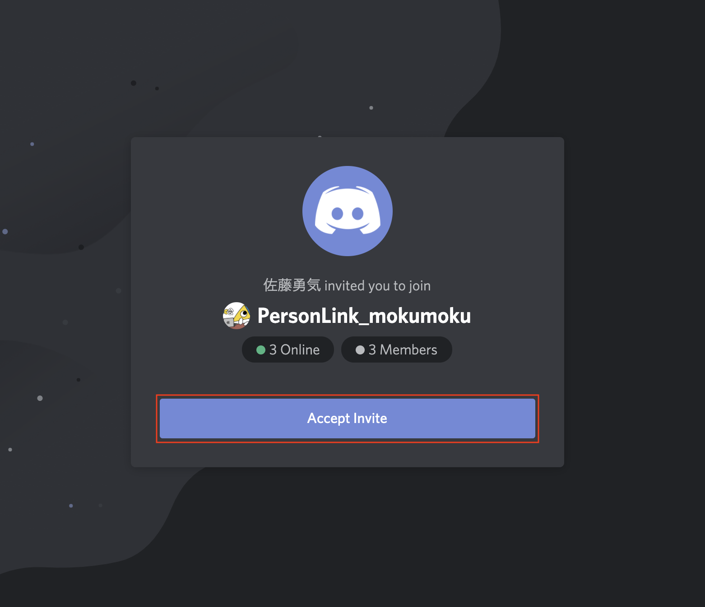
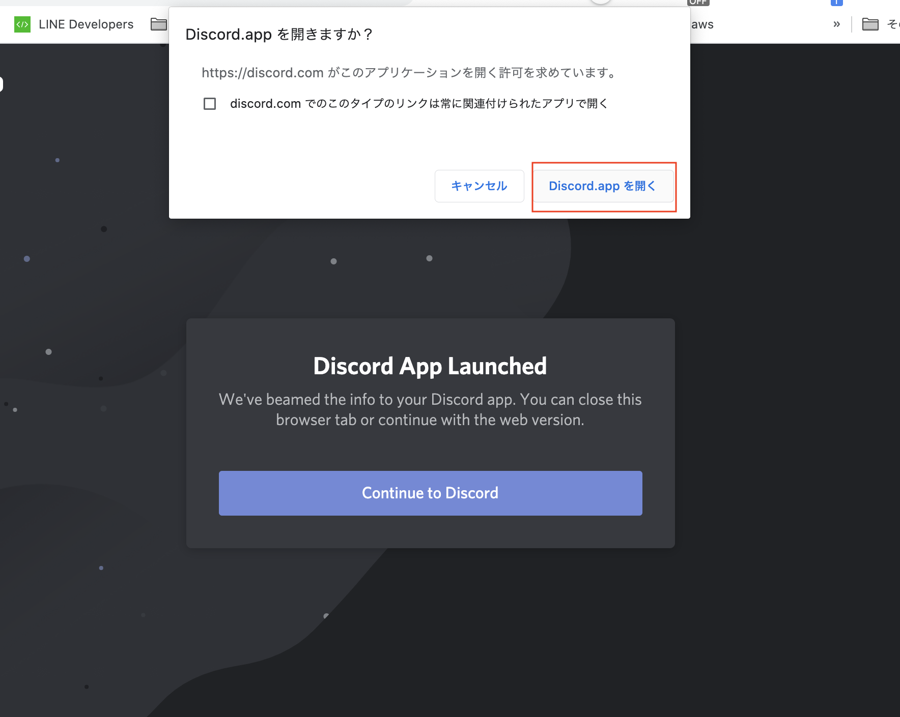
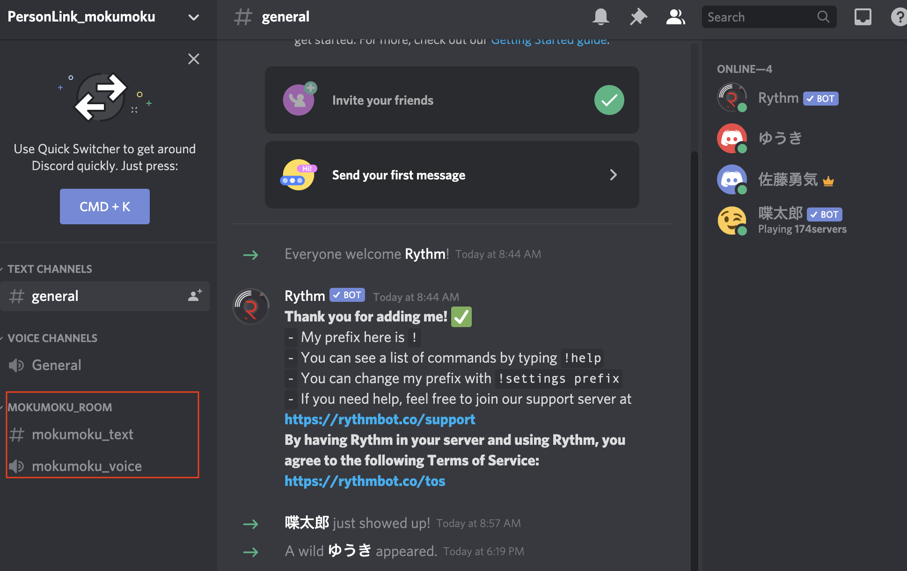
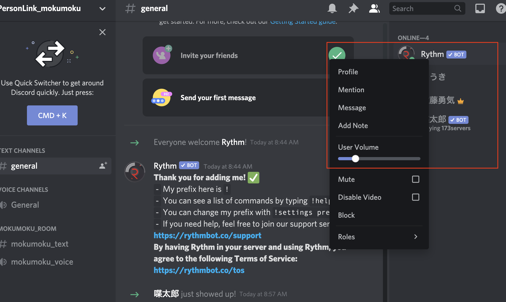

<!--
headingDivider: 1
-->
# discordの入り方説明

# Discordの招待リンクに入ってください。
https://discord.gg/7yFeNC2b

そしたら画像のAccept Inviteを押してください

# Discordを開く
もしdiscordがダウンロード済みであれば上のようにアラートが出ますのでdiscordを開いてください。

# MOKUMOKU＿ROOM

mokumoku_text: テキストでやりとり
mokumoku_voice: 音声でやりとり

mokumoku_voiceをクリックしてください。

 

# 音がうるさい時
UserVolumeで調整ができますので音量が大きすぎる場合は調整してみてください。

# その他トラブルシューティングは当日対応いたします。
よろしくお願いします。

